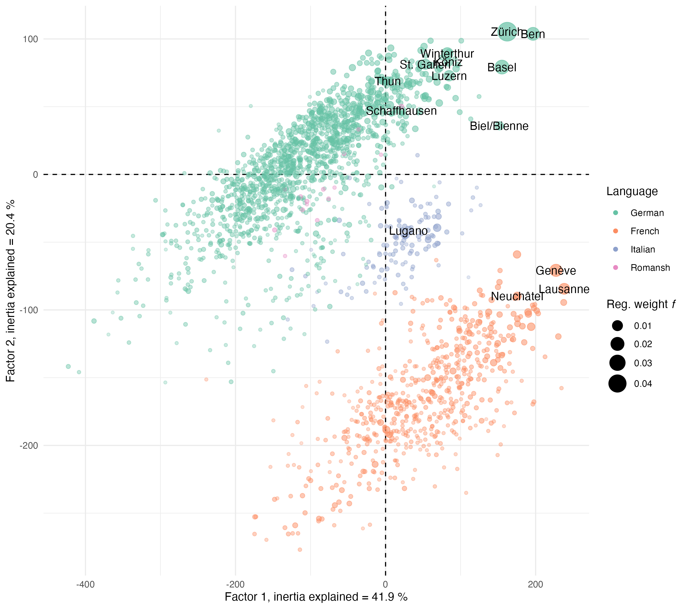
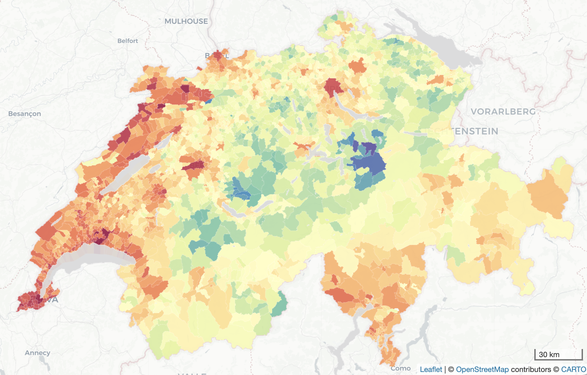
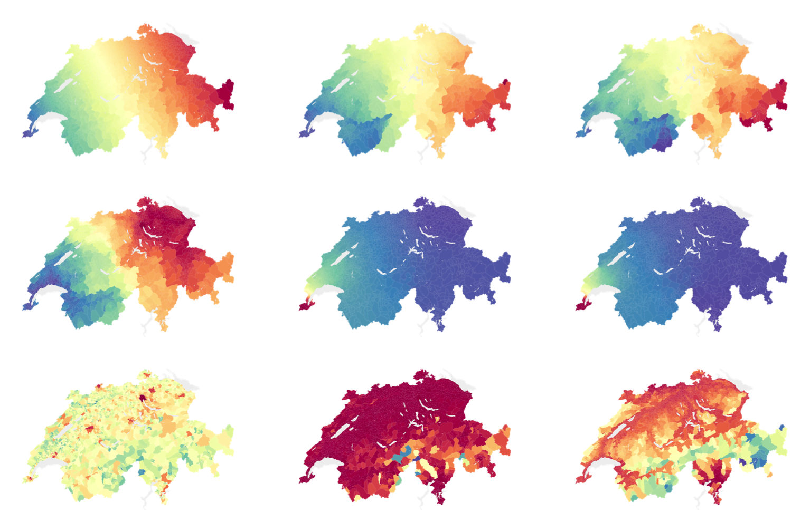

# Spatial Autocorrelation of Political Opinions: the case of Swiss Federal Votes

### Romain Loup, François Bavaud

This repository contains the data and code in order to produce the results in the article <a href=https://> *Spatial Autocorrelation of Political Opinions: the case of Swiss Federal Votes*</a>, with applications to the Swiss ballot vote results at the municipality scale.

## Abstract 
The kernel approach to spatial analysis, well adapted to weighted, multivariate configurations involving $n$ regions, results from the comparison of two symmetric $n\times n$ matrices, a feature kernel and a spatial kernel. Many possible constructions can be contemplated,
and the versatility of the approach is illustrated by considering four feature kernels and ten spatial kernels applied on the results of the 369 Swiss federal votes from 1971 to 2023 on the $n=2132$ municipalities. The usual constructs (visualization by kernel spectral decomposition, spatial autocorrelation and its testing, Moran-Anselin scatterplots, LISA) are presented in this framework, and new developments (discriminant analysis, categorical kernels, kernel aggregation) are proposed. Among other findings, the pervasive association of political opinion with regional language and population size is highlighted at municipal, district and cantonal level.

## Keywords
spatial autocorrelation; spatial weights; kernels; voting analysis; weighted MDS

## Some results

First and second MDS political factor scores extracted from $\mathbf{K}_{\mbox{\tiny simple}}$

<figure>
    
</figure>

Mapping of the first factor score from MDS on $\mathbf{K}_{\mbox{\tiny simple}}$

<figure>
    
</figure>

Mapping of the first factor score for 
(1) $\mathbb{K}_{\mbox{\tiny geo}}$, (2) $\mathbb{K}_{\mbox{\tiny road}}$, (3) $\mathbb{K}_{\mbox{\tiny time}}$, (4) $\mathbb{K}_{\mbox{\tiny deter}}$, (5)  $\mathbb{K}_{\mbox{\tiny diff}}$,  (6) $\mathbb{K}_{\mbox{\tiny MH}}$,  (7) $\mathbb{K}_{\mbox{\tiny size}}$,  (8) $\mathbb{K}_{\mbox{\tiny dens}}$ and   (9) $\mathbb{K}_{\mbox{\tiny elev}}$   (in order). The diffusion time has been set to $t=10$ for $\mathbb{K}_{\mbox{\tiny diff}}$. The map for $\mathbb{K}_{\mbox{\tiny ling}}$

<figure>
    
</figure>
